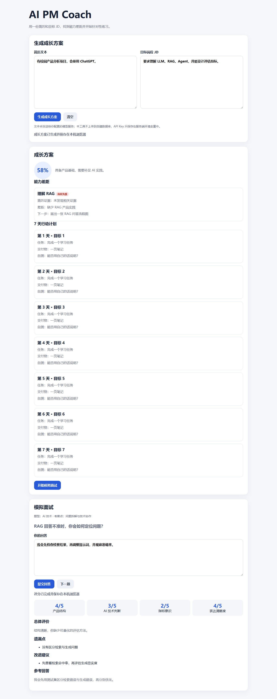
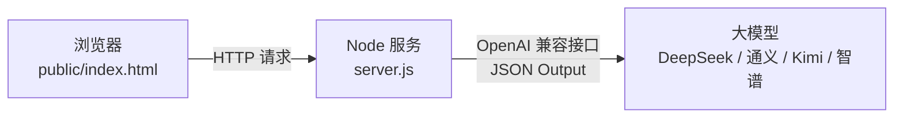

# AI PM Coach — AI 产品经理求职教练


面向 AI 产品经理求职者的轻量教练。粘贴简历和目标岗位 JD 后，生成有证据约束的能力差距、7 天行动计划，并提供针对性模拟面试与四维评分。

**[在线体验 →](https://ai-pm-coach-omega.vercel.app/)**



## 目录

- [业务背景](#业务背景)
- [用户场景](#用户场景)
- [人机方案](#人机方案)
- [产品设计](#产品设计)
- [技术架构](#技术架构)
- [评测](#评测)
- [本地运行](#本地运行)
- [项目结构](#项目结构)
- [项目边界](#项目边界)

## 业务背景

AI 产品经理岗位的求职建议普遍存在两个问题：通用建议很难落到具体 JD（"多了解Agent"不如"你的简历缺RAG评测经验"），求职者也缺少可重复练习的反馈闭环（模拟面试只能找朋友，无法随时练习并获得结构化评分）。

本项目验证的核心问题：**能否把简历证据、JD 要求、行动计划、模拟面试串成一个闭环，同时要求模型不得编造经历或数据？**

## 用户场景

- **目标用户**：AI 产品经理求职者（校招/社招）
- **核心场景**：
  1. 粘贴简历文本 + 目标岗位 JD → 生成能力差距分析和 7 天行动计划
  2. 基于差距点开始模拟面试 → 回答后获得四维评分和改进建议
- **边界**：MVP 不做账号、数据库、PDF/DOCX 解析、自动搜岗或自动投递，先验证核心建议是否有用

## 人机方案

| 环节 | AI 负责 | 人负责 |
|------|---------|--------|
| 差距分析 | 基于简历文本和JD提取能力要求，逐条对比，标注证据来源 | 判断差距分析是否准确，决定采纳哪些建议 |
| 行动计划 | 生成7天可执行计划，每天1-2个具体任务 | 按计划执行，根据实际情况调整 |
| 模拟面试 | 基于差距点出题，用户回答后四维评分 | 真实回答，不查资料 |
| 评分反馈 | 内容相关性/逻辑结构/产品思维/表达清晰度四维打分 | 识别AI误判，不盲目接受评分 |

关键设计：模型**不得编造简历中没有的经历或数据**。差距分析必须标注简历中的证据来源，无证据的要求标记为"简历未体现"而非"不具备"。

## 产品设计

### 核心流程

```
粘贴简历 + JD → 生成成长方案（匹配概览/能力差距/7天计划）
              → 开始模拟面试（基于差距点出题）
              → 回答提交 → 四维评分 + 改进建议
              → 刷新可恢复最近结果
```

### 产品思路

- **问题**：通用求职建议很难落到具体 JD，求职者也缺少可重复练习的反馈闭环
- **方案**：把简历证据、JD 要求、行动计划、模拟面试串成一个流程，并要求模型不得编造经历或数据
- **衡量**：下一步将通过真实用户测试记录核心流程完成率、建议采纳率和单次调用成本；**当前不展示未经验证的效果数字**
- **边界**：MVP 不做账号、数据库、文档解析和自动投递，先验证核心建议是否有用

### 四维评分标准

| 维度 | 考察点 |
|------|--------|
| 内容相关性 | 回答是否切中问题，是否结合简历和JD |
| 逻辑结构 | 回答是否有框架、有层次、结论先行 |
| 产品思维 | 是否体现需求分析、方案设计、风险意识 |
| 表达清晰度 | 语言是否简洁、准确、无冗余 |

## 技术架构



### 技术选型

- **前端**：原生 HTML/CSS/JS，单文件，无框架依赖
- **后端**：Node.js 原生 HTTP 服务，无第三方依赖
- **模型**：DeepSeek（默认），通过环境变量可切换通义千问/Kimi/智谱
- **部署**：Vercel Serverless Functions
- **数据存储**：浏览器 localStorage（仅存最近一次结果，清空即删除）

### 安全设计

- API Key 只在当前页面内存中存在，不写入 localStorage、文件或日志
- 服务端从环境变量读取 Key，不暴露到前端
- 简历和 JD 会发送给配置的模型服务，提示用户不输入身份证号、手机号等敏感信息
- 自检使用注入的固定模型响应，不消耗 API 额度

## 失败案例与异常兜底

### 失败案例：模型编造简历中没有的经历

**现象**：V1 版本提示词只要求"分析简历与 JD 的差距"，模型在差距分析中编造了简历中不存在的项目经历（如"你有 RAG 项目经验"，但简历里只写了"了解大模型应用"）。

**修复**：
- 提示词增加硬约束："只能引用简历中明确出现的内容，不得推断或编造经历"
- 差距分析必须标注证据来源（简历原文片段），无证据的要求标记为"简历未体现"而非"不具备"
- 输出格式改为 JSON，每条差距必须包含 `evidence` 字段

**反思**：求职场景下，编造经历比"能力不足"更危险——如果求职者真的按 AI 编造的内容去面试，会被一问就穿。提示词约束和结构化输出是必要的安全网。

### 异常兜底

| 异常场景 | 处理方式 |
|----------|----------|
| 简历或 JD 为空 | 拒绝生成，提示"请粘贴简历和 JD" |
| 模型返回非 JSON 格式 | 重试一次，仍失败则提示"服务繁忙，请稍后重试" |
| API Key 未配置或失效 | 提示检查配置，不发送请求 |
| 简历含敏感信息（手机号/身份证） | 提示用户脱敏，不主动拦截但给出警告 |
| 模型服务超时 | 30 秒超时，提示重试，不无限等待 |

## 评测

### 自检覆盖

```powershell
npm test
```

自检使用注入的固定模型响应，不消耗 API 额度，覆盖：
- 正常生成结构化成长方案
- 拒绝空简历
- 模拟面试出题与四维评分闭环

### 当前局限

- 尚未进行真实用户测试，无核心流程完成率、建议采纳率等数据
- 模拟面试为单轮问答，不支持多轮追问
- 只支持文本粘贴，不解析 PDF/DOCX
- 评分标准为模型自评，未经过人工校准

## 在线部署

项目可直接部署到 Vercel。将 `AI_API_KEY` 配置为 Vercel 环境变量；可选配置 `AI_API_BASE_URL` 和 `AI_MODEL`。API Key 不应写入仓库。

## 在线体验

直接访问 [AI PM Coach](https://ai-pm-coach-omega.vercel.app/)。仓库中的 Node 服务和测试文件用于实现审阅与回归验证，不作为作品集访问入口。

## 项目结构

```
├── README.md
├── package.json
├── server.js              # Node 本地服务 + API 代理
├── server.test.js         # 自检
├── vercel.json            # Vercel 部署配置
├── api/[...path].js       # Vercel Serverless 入口
├── public/index.html      # 前端单文件
└── preview.png            # 产品截图
```

## 项目边界

第一版只支持粘贴文本，不解析 PDF/DOCX；不包含账号、云数据库、RAG、自动搜岗或自动投递。只有真实使用证明这些功能必要时再添加。

## License

MIT
